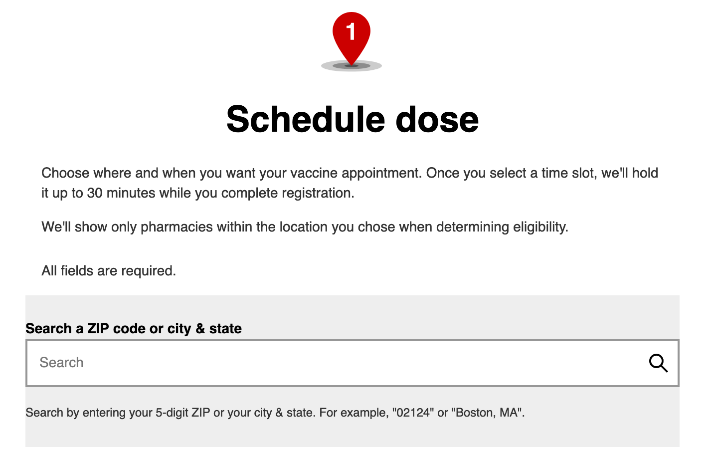

# Vaccine Alert

Plays an obnoxious sound when a vaccine is available.

This utility currently only supports CVS and MacOS

## How to use

Keep a browser open to the CVS's COVID vaccine zip code search page. Fill out their eligibility form to get to this page

Run this script and keep your device alive (`pmset noidle` on mac does the trick).  When you hear an "awooga" alert sound then quickly hit submit on the zip code search form.  You should ideally see appointments available, however they go pretty quickly, so act fast!

## How to run

- [Install node, npm and typescript](https://www.typescriptlang.org/download)
- Run `npm install`
- Run `npm start -- YOUR_ZIP_CODE_HERE`

